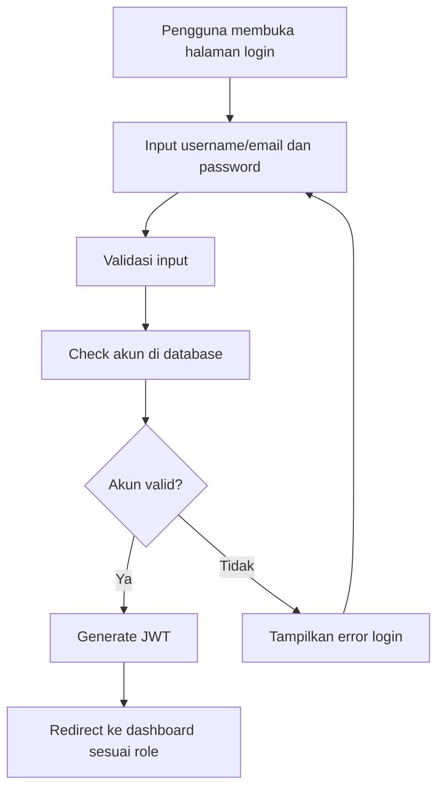
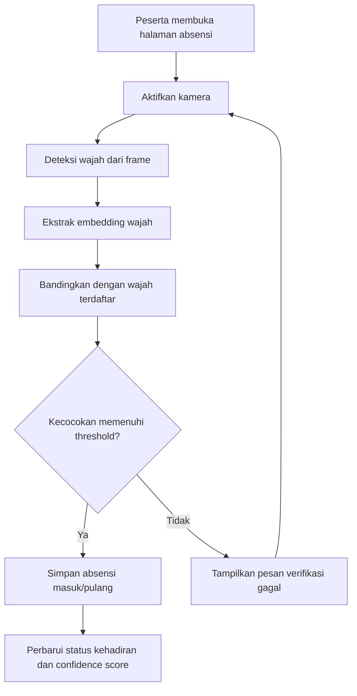
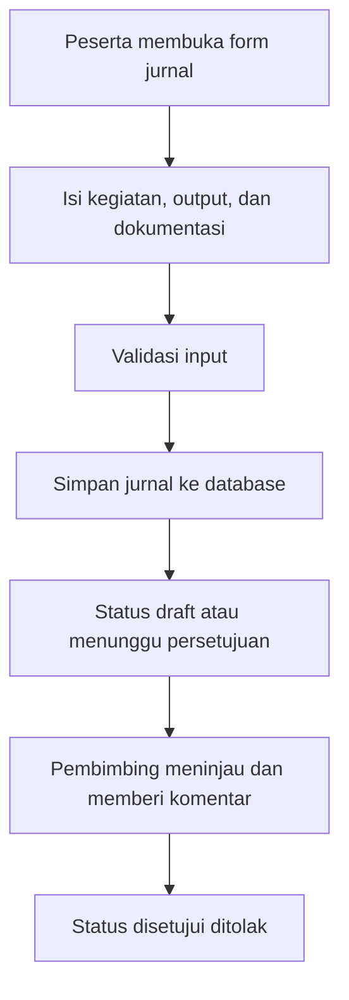
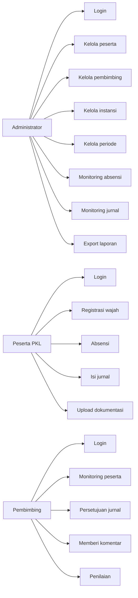
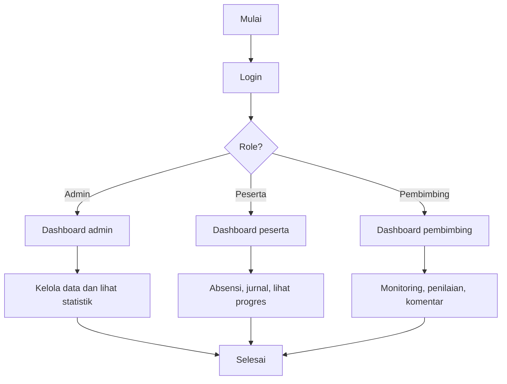
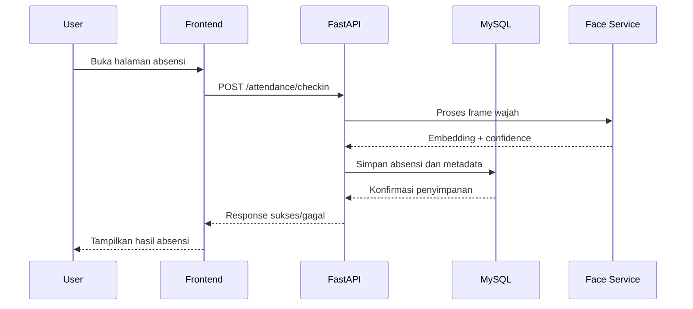
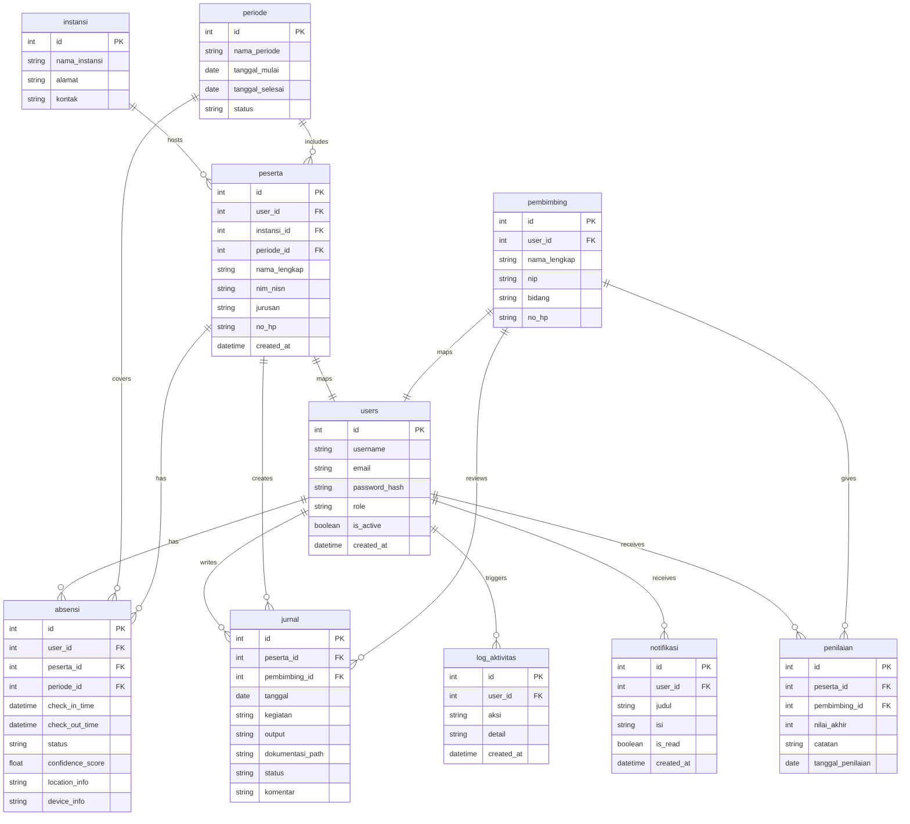
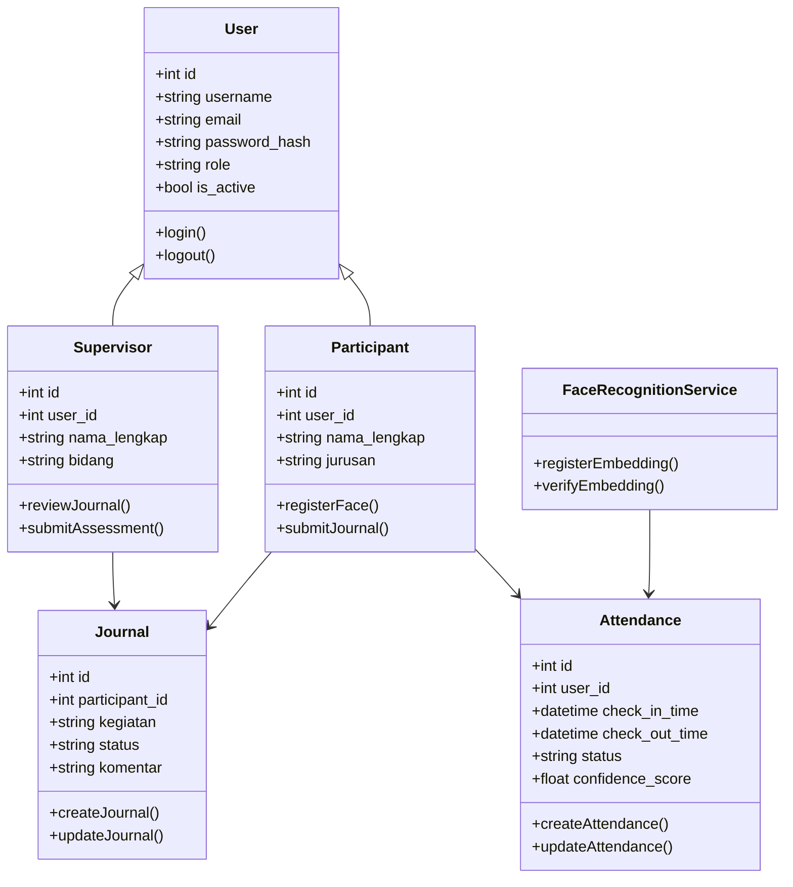
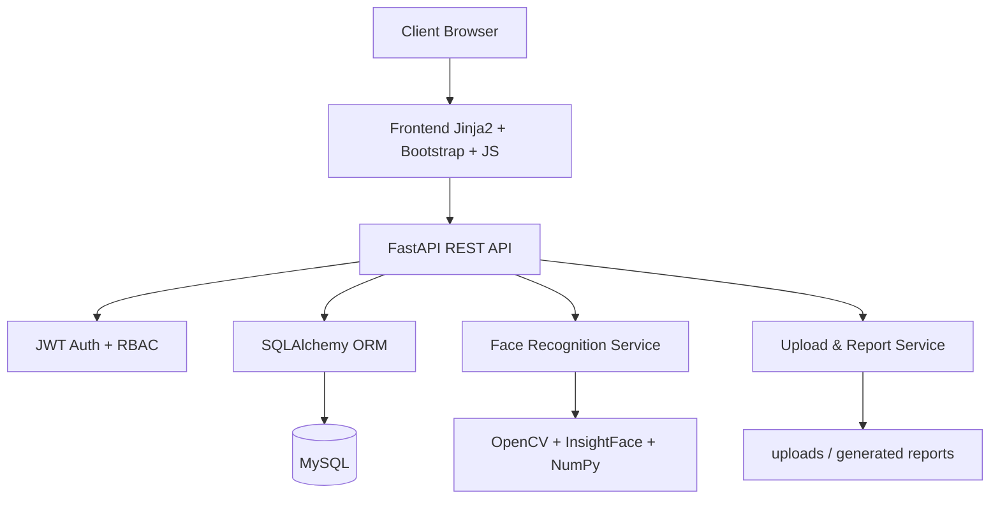
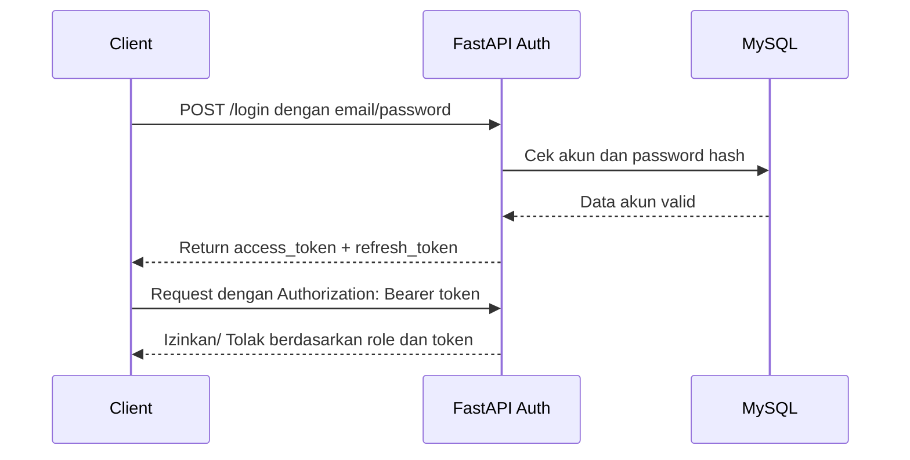

# Pengembangan Aplikasi Monitoring PKL Berbasis Web

## Judul Proyek
Pengembangan Aplikasi Monitoring PKL Berbasis Web dengan Fitur Absensi Verifikasi Wajah, Jurnal Kegiatan, dan Manajemen Data Pembimbing di Dinas Komunikasi dan Informatika Kabupaten Batu Bara.

## 1. Analisis Kebutuhan Sistem

### 1.1 Latar Belakang
Aplikasi monitoring PKL diperlukan untuk menggantikan proses manual yang sering kali memakan waktu, rentan kesalahan, dan sulit dipantau secara real-time. Sistem ini dirancang untuk membantu peserta PKL, pembimbing, dan administrator dalam mengelola kegiatan PKL secara digital, aman, dan terstruktur.

### 1.2 Tujuan Sistem
- Memudahkan absensi peserta PKL secara digital.
- Meningkatkan akurasi verifikasi kehadiran melalui wajah.
- Menyediakan ruang jurnal kegiatan yang terintegrasi.
- Mempermudah pembimbing melakukan monitoring, penilaian, dan pemberian komentar.
- Menyediakan dashboard statistik untuk administrator.

### 1.3 Ruang Lingkup
- Pengelolaan akun pengguna.
- Pengelolaan data peserta, pembimbing, instansi, dan periode.
- Absensi masuk dan pulang berbasis verifikasi wajah.
- Pengisian jurnal kegiatan dan dokumentasi.
- Monitoring penilaian dan progres peserta.
- Export laporan PDF dan Excel.

### 1.4 Kebutuhan Fungsional
- Administrator dapat login, mengelola data, memantau absensi, jurnal, penilaian, dan export laporan.
- Peserta PKL dapat login, mendaftar wajah, melakukan absensi, mengisi jurnal, mengunggah dokumentasi, dan melihat komentar pembimbing.
- Pembimbing dapat melihat peserta, memantau absensi, menyetujui jurnal, memberi komentar, dan menilai peserta.

### 1.5 Kebutuhan Non-Fungsional
- Keamanan: JWT, hashing password, RBAC, logging.
- Kinerja: respons API cepat untuk operasi harian.
- Reliabilitas: data harus tersimpan dengan aman dan konsisten.
- Kemudahan pemeliharaan: arsitektur modular dan terstruktur.

---

## 2. Flowchart Proses Utama

### 2.1 Flowchart Login dan Autentikasi


### 2.2 Flowchart Absensi Verifikasi Wajah


### 2.3 Flowchart Pengisian Jurnal


---

## 3. Use Case Diagram


---

## 4. Activity Diagram


---

## 5. Sequence Diagram


---

## 6. ERD (Entity Relationship Diagram)


---

## 7. Class Diagram


---

## 8. Struktur Database Beserta Relasi

### 8.1 Tabel Utama
| Tabel | Fungsi | Keterangan |
|---|---|---|
| users | Akun login | Menyimpan identitas akun dan role |
| peserta | Data peserta PKL | Berelasi ke users dan instansi/periode |
| pembimbing | Data pembimbing | Berelasi ke users |
| instansi | Data instansi tempat PKL | Menandai lokasi serta organisasi |
| periode | Periode pelaksanaan PKL | Menentukan rentang waktu PKL |
| absensi | Data kehadiran | Menyimpan status masuk dan pulang |
| jurnal | Catatan kegiatan harian | Disetujui atau ditolak pembimbing |
| penilaian | Penilaian akhir atau berkala | Diberikan oleh pembimbing |
| notifikasi | Pemberitahuan sistem | Dapat ditampilkan ke pengguna |
| log_aktivitas | Riwayat aktivitas | Menyimpan log penting pengguna |

### 8.2 Relasi Inti
- users 1-to-1 peserta
- users 1-to-1 pembimbing
- instansi 1-to-many peserta
- periode 1-to-many peserta
- users 1-to-many absensi
- peserta 1-to-many absensi
- peserta 1-to-many jurnal
- pembimbing 1-to-many jurnal
- peserta 1-to-many penilaian
- pembimbing 1-to-many penilaian

### 8.3 Constraint yang Direkomendasikan
- `NOT NULL` pada field kunci penting.
- `UNIQUE` pada username/email.
- `CHECK` untuk status absensi (`hadir`, `terlambat`, `izin`, `alpha`).
- `FOREIGN KEY` untuk menjaga integritas relasi.

---

## 9. Struktur Folder Proyek
```text
absensi/
├── app/
│   ├── main.py
│   ├── config.py
│   ├── database.py
│   ├── models/
│   ├── schemas/
│   ├── routers/
│   ├── services/
│   ├── repositories/
│   ├── middleware/
│   ├── authentication/
│   ├── ai/
│   ├── utils/
│   ├── static/
│   ├── templates/
│   └── uploads/
├── migrations/
├── tests/
├── requirements.txt
├── .env.example
├── README.md
└── docs/
```

---

## 10. Desain REST API

### 10.1 Autentikasi
| Method | Endpoint | Deskripsi |
|---|---|---|
| POST | /login | Login pengguna |
| POST | /logout | Logout sesi |
| POST | /register | Registrasi akun baru |

### 10.2 Face Recognition
| Method | Endpoint | Deskripsi |
|---|---|---|
| POST | /face/register | Daftarkan embedding wajah |
| POST | /face/verify | Verifikasi wajah saat absensi |

### 10.3 Attendance
| Method | Endpoint | Deskripsi |
|---|---|---|
| POST | /attendance/checkin | Absensi masuk |
| POST | /attendance/checkout | Absensi pulang |
| GET | /attendance/history | Riwayat absensi |

### 10.4 Journal
| Method | Endpoint | Deskripsi |
|---|---|---|
| POST | /journal | Tambah jurnal |
| PUT | /journal/{id} | Edit jurnal |
| DELETE | /journal/{id} | Hapus jurnal |
| GET | /journal | Daftar jurnal |

### 10.5 Management
| Method | Endpoint | Deskripsi |
|---|---|---|
| GET | /users | Daftar pengguna |
| GET | /participants | Daftar peserta |
| GET | /supervisors | Daftar pembimbing |
| GET | /dashboard | Statistik dashboard |
| GET | /reports | Rekap laporan |

---

## 11. Desain Antarmuka (UI/UX)

### 11.1 Prinsip Desain
- Modern, bersih, dan formal.
- Sesuai untuk aplikasi pemerintahan.
- Navigasi sederhana dengan warna tema biru dan putih.
- Responsif untuk desktop dan tablet.

### 11.2 Halaman Utama
- Halaman login.
- Dashboard berdasarkan role.
- Halaman daftar peserta.
- Halaman absensi wajah.
- Halaman jurnal harian.
- Halaman penilaian.
- Halaman laporan PDF/Excel.

### 11.3 UX Recommendation
- Pengguna dapat melihat status absensi dengan cepat.
- Tombol aksi harus jelas dan konsisten.
- Pemberitahuan sukses/gagal ditampilkan melalui toast atau alert.
- Form disusun singkat dan mudah dipahami.

---

## 12. Arsitektur Sistem


### 12.1 Komponen Utama
- Frontend: HTML, CSS, Bootstrap, JavaScript, Jinja2.
- Backend: FastAPI, SQLAlchemy, Pydantic, JWT.
- AI: OpenCV, InsightFace, NumPy.
- Database: MySQL.
- Laporan: ReportLab, Pandas, OpenPyXL.

---

## 13. Penjelasan Backend Python
Backend dikembangkan menggunakan FastAPI karena performansi tinggi, dokumentasi otomatis, dan dukungan dependency injection yang baik. Struktur aplikasi dibagi menjadi modul yang jelas:
- `routers` untuk endpoint API.
- `services` untuk logika bisnis.
- `repositories` untuk akses data.
- `schemas` untuk validasi request/response.
- `models` untuk representasi tabel database.
- `authentication` untuk JWT dan RBAC.
- `ai` untuk transaksi verifikasi wajah.

### 13.1 Kelebihan FastAPI
- Dokumentasi otomatis via Swagger UI.
- Validasi data berbasis Pydantic.
- Skalabel untuk aplikasi pemerintahan.
- Cocok untuk integrasi AI dan layanan laporan.

---

## 14. Alur Kerja AI Verifikasi Wajah
1. Kamera aktif saat halaman absensi dibuka.
2. OpenCV mengambil frame video.
3. Wajah dideteksi dari frame.
4. InsightFace menghasilkan embedding wajah.
5. Embedding dibandingkan dengan embedding wajah yang tersimpan.
6. Jika similarity melebihi threshold, absensi berhasil.
7. Sistem menyimpan metadata absensi, confidence score, status, dan waktu.
8. Foto wajah mentah tidak disimpan secara permanen, hanya metadata verifikasi.

### 14.1 Rekomendasi Threshold
- Threshold awal: 0.70 - 0.80 tergantung data latih dan kualitas kamera.
- Jika terlalu tinggi, false negative akan meningkat.
- Jika terlalu rendah, false positive akan meningkat.

---

## 15. Alur Autentikasi JWT


### 15.1 Flow JWT
- Login berhasil menghasilkan access token.
- Token berisi claim user_id, role, exp.
- Middleware memeriksa token sebelum mengakses route.
- Role-based access control membatasi fitur sesuai peran.

---

## 16. Rencana Implementasi Selama 2 Bulan

### Minggu 1-2: Persiapan dan Analisis
- Menentukan kebutuhan sistem.
- Membuat desain database.
- Menyiapkan lingkungan Python, FastAPI, MySQL.
- Membuat struktur folder proyek.

### Minggu 3-4: Modul Dasar
- Implementasi auth, role, CRUD user.
- Implementasi modul peserta, pembimbing, instansi, periode.
- Membuat dashboard dasar.

### Minggu 5-6: Absensi dan AI
- Integrasi OpenCV dan InsightFace.
- Membuat endpoint absensi.
- Menyimpan metadata verification hasil.

### Minggu 7: Jurnal, Penilaian, dan Notifikasi
- Pengisian jurnal.
- Persetujuan jurnal oleh pembimbing.
- Penilaian dan komentar.

### Minggu 8: Laporan dan Pengujian
- Export PDF dan Excel.
- Pengujian black box dan UAT.
- Perbaikan bug dan dokumentasi akhir.

---

## 17. Daftar Pengujian Sistem

### 17.1 Black Box Testing
- Login berhasil dan gagal.
- Absensi wajah berhasil dan gagal.
- Pengisian jurnal berhasil dan ditolak.
- Admin dapat mengelola data peserta dan pembimbing.
- Export laporan PDF/Excel berjalan.

### 17.2 User Acceptance Testing (UAT)
- Administrator menilai kemudahan dashboard.
- Pembimbing menilai kelengkapan monitoring.
- Peserta menilai kemudahan absensi dan jurnal.
- Sistem dinilai sesuai kebutuhan instansi.

---

## 18. Saran Pengembangan Sistem di Masa Depan
- Integrasi dengan sistem absensi fingerprint atau RFID.
- Penerapan deteksi lokasi GPS yang lebih presisi.
- Penggunaan model AI yang lebih akurat untuk variasi pencahayaan.
- Notifikasi real-time via email atau WhatsApp.
- Penyediaan mobile app untuk pengguna.
- Integrasi dengan sistem kepegawaian atau SAPD instansi.

---

## 19. Kesimpulan
Sistem monitoring PKL berbasis web ini dirancang agar realistis, modern, dan mampu dikembangkan oleh satu mahasiswa PKL dalam kurun waktu sekitar dua bulan. Dengan pendekatan modular, backend Python FastAPI, database MySQL, dan AI verifikasi wajah berbasis InsightFace, aplikasi ini cukup layak dijadikan solusi digital untuk mendukung kegiatan PKL di lingkungan pemerintahan.
